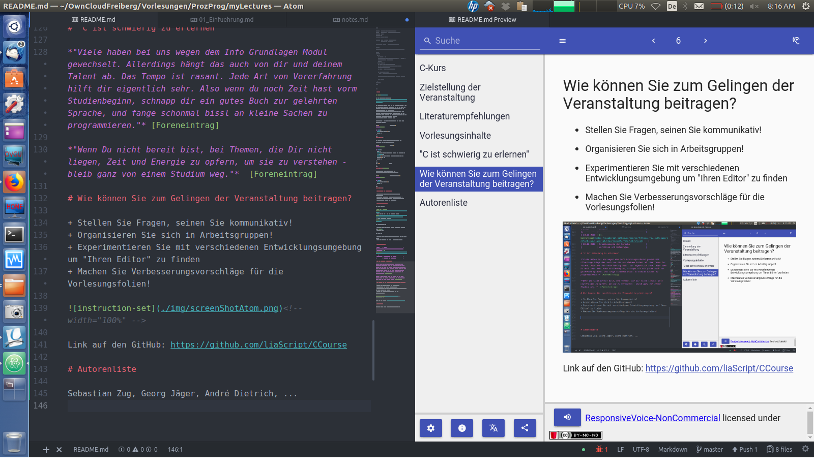

<!--

author:   Sebastian Zug & Georg Jäger
email:    sebastian.zug@informatik.tu-freiberg.de & Georg.Jaeger@informatik.tu-freiberg.de
version:  0.0.1
language: de
narrator: Deutsch Female

import: https://raw.githubusercontent.com/LiaTemplates/Rextester/master/README.md

-->

# Vorlesung Softwareprojekt

Der vorliegende Kurs realisiert die Vorlesung "Softwareprojekt" an der TU Bergakademie
Freiberg auf der Basis von LiaScript. Eine interaktive Darstellung der Inhalte ist unter

[LiaScripLink](https://liascript.github.io/course/?https://raw.githubusercontent.com/SebastianZug/SoftwareprojektRobotik/master/README.md#1)

zu finden.

Die
Veranstaltung richtet sich an Informatiker und Mathematiker und adressiert die folgenden Punkte:

+ aufbauend auf dem vorangegangenen Kurs Softwareentwicklung werden die Konzepte von C++ erläutert
+ Einführung in das Robot Operating System (ROS)
+ Elemente von Robotersystemen und deren Implementierung wie
     + Grundlagen der Sensoren und deren Einbettung in ROS
     + Aktoren und deren Regelung
     + Karten, deren Erzeugung und Nutzung
+ Architekturkonzepte für Roboteranwendungen

| Datum      | Titel      | GitHub-Link | LiaScript-Link |
| ---------- | ---------- | ----------- | -------------- |
| 14.10.2019 | Einführung | [Link](https://github.com/SebastianZug/SoftwareprojektRobotik/blob/master/00_Einfuehrung.md)            |  [Link](https://liascript.github.io/course/?https://raw.githubusercontent.com/SebastianZug/SoftwareprojektRobotik/master/00_Einfuehrung.md#1)              |


## Organisatorisches (WS 2019/20)

**Dozenten**

| Name             | Email                                      |
|:-----------------|:-------------------------------------------|
| Sebastian Zug    | sebastian.zug@informatik.tu-freiberg.de    |
| Georg Jäger      | georg.jaeger@informatik.tu-freiberg.de     |


**Zielstellung der Veranstaltung**

* Anwendungsbereites Programmierverständnis unter C++
* Verständnis für die Basiskonzepte von ROS und ein
* Basiswissen in verschiedenen Bereichen der Robotik

... als Vorbereitung auf die praktischen Aufgaben.

**Zeitaufwand und Engagement**

Die Veranstaltung ist in zwei Teile gegliedert. Im Wintersemester werden Sie
zunächst mit den Grundlagen vertraut gemacht, um :

* als Informatiker am Ende eine mündliche Prüfung zu absolvieren und im Sommersemester eine praktische Aufgabe umzusetzen.
* als Mathematiker mit einer kleineren Aufgabe am Ende des Semester die Veranstaltung abzuschließen.

Der Zeitaufwand beträgt 180h und setzt sich zusammen aus 60h Präsenzzeit und
120h Selbststudium. Letzteres umfasst die Vor- und Nachbereitung der
Lehrveranstaltungen, die eigenständige Lösung von Übungsaufgaben sowie die
Prüfungsvorbereitung.

**Die eigene Beschäftigung mit der C++ Programmierung und den Konzepten von ROS ist für das erfolgreiche Bestehen der Veranstaltung unabdingbar!**

## Literaturempfehlungen

**Online Kurse**

**Videotutorials**

**Bücher**

+ Torsten T. Will, "C++ - Das umfassende Handbuch", Rheinwerk Computing 2019

## Ok, womit soll ich anfangen?

1. Legen Sie sich ein Repository an, mit dem Sie arbeiten!
2. Entscheiden Sie sich für Linux als Betriebssystem auf Ihrem Rechner :-), in diesem Fall sind alle Tools die Sie im Laufe des Semesters benötigen, sofort greifbar.
3. Starten Sie mit kleinen Beispielen, um Ihre Algorithmischen Fähigkeiten zu schulen und sich zum anderen mit der Semantik von C++ vertraut zu machen.

Wenn Sie Punkt 2. nicht uneingeschränkt folgen wollen, hätten Sie zumindest für die Einführung zu C++ unter Windows folgende Möglichkeiten:

| Toolchain       | Link                                                                                  | Bemerkung |
| --------------- | ------------------------------------------------------------------------------------- | --------- |
| Visual Studio   |                                                                                       |           |
| MinGW           | [MinGW Webseite](http://www.mingw.org/)                                               |           |
| Cygwin          | [Cygwin Webseite](https://cygwin.com/)                                                |           |
| Linux-Subsystem | [Microsoft Dokumentation](https://docs.microsoft.com/de-de/windows/wsl/install-win10) |           |

Hinsichtlich Ihres Lieblingseditors haben Sie sicher schon eine Wahl getroffen.

## Ein Wort LiaScript

Für den ersten Punkt wird der Quellcode direkt in das LiaScript-Dokument eingebettet und kann damit im Browser bearbeitet werden. Dabei ist ein "Versionssystem light" verfügbar, das Änderungen lokal im Browser abspeichert. Basis für die Ausführungsumgebung ist die API von Rextester https://rextester.com/. Vielen Dank für diesen Service!

Ausführbarer C++ Code sieht wie folgt aus, der Titel kann weggelassen werden.

```cpp                     HelloWorld.cpp
#include <iostream>
using namespace std;

int main()
{
    cout << "Hello, World!";
    return 0;
}
```
@Rextester.CPP

Der Markdown-Quellcodeblock wird dafür um den Makroaufruf `@Rextester.CPP` am
Ende ergänzt. Dabei können unterschiedliche Compiler (gcc, clang, Microsoft C++ Compiler) und Parametersets genutzt werden.

```
@Rextester.CPP
@Rextester.CPP_clang
@Rextester.CPP_vc
```

Im Weiteren ist es möglich "Kommandozeilenparameter" an die Rextester-Ausführungsumgebung
zu übergeben und diese dann auch im Browser zu variieren. In diesem Fall werden
die Parameter in einem separaten Codeblock angefügt, gefolgt von der Anweisung
`@Rextester.CPP(true,@input(1))`

```cpp                     HelloWorld.cpp
#include <iostream>
using namespace std;

int main()
{
    int input{};
    int output{};

    cout << "Bitte geben Sie eine Zahl ein!" << endl;
    cin >> input;
    output = input * 2;
    cout << "Das Doppelte dieser Zahl ist " << output << "." << endl;
    return 0;
}
```
```
5
```
@Rextester.CPP(false,`@input(1)`)

Der boolsche Parameter kann genutzt werden um eine knappe Statistik der Kompilierung
und der Ausführungsparameter abzurufen.

Darüber hinaus können auch komplette Parameterset an den Compiler übergeben werden, um zum Beispiel die verschiedenen C++ Versionen zu evaluieren. Wenn Sie zum Beispiel in folgendem Beispiel, dass mit dem Makroaufruf

```
@Rextester.eval(@CPP, false, ,`-Wall -std=c++98 -O2 -o a.out source_file.cpp`)
```

kompiliert wird, versuchen `auto` und die uniforme Initialisierung zu nutzen (jeweils ab C++11), generiert der Compiler einen Fehler.

```cpp                     HelloWorld.cpp
#include <iostream>
using namespace std;

int main()
{
    int output = 5;
    //auto output {5};
    cout << output;
    return 0;
}
```
@Rextester.eval(@CPP, false, ,`-Wall -std=c++98 -O2 -o a.out source_file.cpp`)

## Wie können Sie zum Gelingen der Veranstaltung beitragen?

* Stellen Sie Fragen, seinen Sie kommunikativ!
* Organisieren Sie sich in Arbeitsgruppen!
* Experimentieren Sie mit verschiedenen Entwicklungsumgebung um "Ihren Editor"
  zu finden
* Machen Sie Verbesserungsvorschläge für die Vorlesungsfolien!

<!-- width="100%" -->
